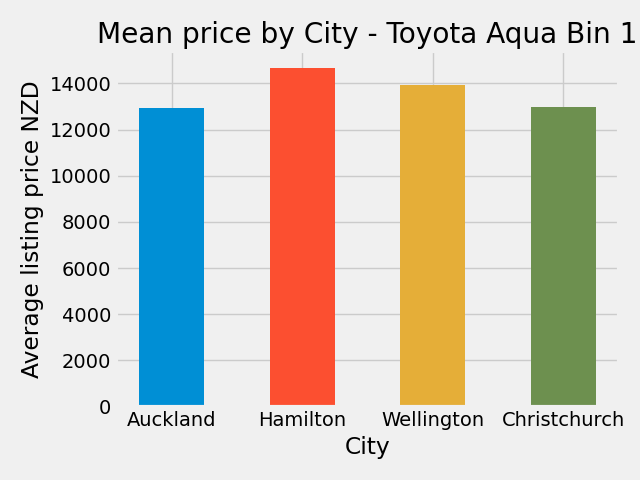
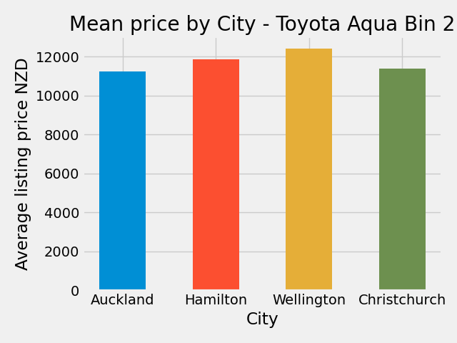
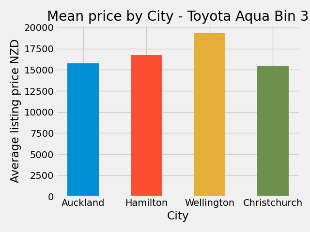
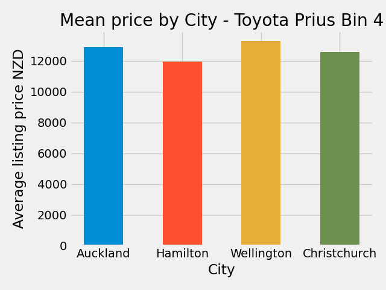
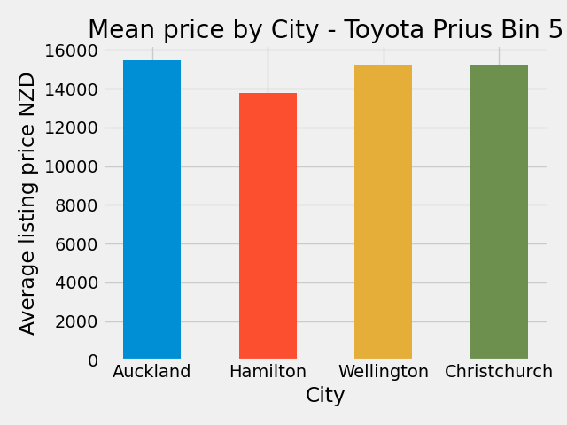

# *Mini-project: Are second hand cars cheaper in Auckland than in the rest of New Zealand?*

## Background and aim

Having spoken with friends and colleagues about their experiences buying second hand cars in New Zealand, I have repeatedly heard that all other things being equal, second hand cars can be found cheaper in Auckland than in the rest of the country.

Presumably this would be due to the fact that ships offload their cargo in Ports of Auckland, and the much larger population of the city results in a greater supply and therefore lower prices.

The goal is to test this hypothesis reviewing the latest listings available on the New Zealand's larges P2P sales website, TradeMe. 

Ideally, any difference should be quantifiable, based on the criteria below, so that a buyer can determine whether it is worth the trouble of travelling to Auckland to purchase their next car. Factors would include:

- The make, model, age, and mileage of the car

- The buyers budget

- The location of the seller across the 5 largest cities (Auckland, Christchurch, Wellington, Hamilton, and Tauranga) as well as North vs South island.  

- Engine size, fuel type, and gearbox

- Private seller vs dealer

## Method

The webscraper **BeautifulSoup** was used to obtain live listings data from TradeMe.

The top selling brand/model combinations nationwide per the listing stats were identified.

An attempt was then made to 'homogenize' listings, grouping those with similar characteristics together (age, mileage etc.) in order to eliminate as many variables as possible from the data. Ideally, location would be the only remaining variable, although there is no way of judging the condition of a vehicle from the listing alone.

The data will be saved down in to csv files, before being analysed using the Pandas, NumPy, and matplotlib libraries.

## Part 1 - Determine most popular manufacturers

The first part of the challenge was to determine how many listings there were for each brand. 

Previously this would have been readily available from the sub-menu on the webpage, with manufacturer links appearing in the format:

- 'Subaru (463 listings)'
- 'Toyota (984 listings)' 

However this has changed, so a script needed to be written to collect it. The inner html from the webpage dropdown list was copied, and a list of manufactuers created in Python.

Beautiful soup was then used to iterate over this list, going to page for each manufacturer's listings, and collecting the number of listings available, and saving the result to a csv file. 

The data was in a string format (e.g. 'Showing 136 results\n') and then needed to be 'cleaned' by stripping away the text, converting the result to a numerical field, and then sorting by the largest number of listings. 

From this it was determined that the top 5 listings accounted for approximately 50% of the car listings on the site, and the decision was made to focus just on those listings for the remainder of the project.

## Part 2 - Listings Webscraper

A webscraper was built to iterate through each page number for the named brand. 

`'https://www.trademe.co.nz/a/motors/cars/{brand}?page={X}'`

Fortunately the summary page showing all listings contained all the following information:

- Make and Model
- Location
- Year of manufacture (and therefore age)
- Mileage
- Engine size and type
- Fuel type
- Gearbox details
- Seller type (private vs dealer)
- Asking price

Further information is available on the invidual listing page, such as colour, safety ratings, import history, number of doors, and number plate etc.

However it was considered unnecessary to scrape 15,000 individual listing pages given the most important information could be obtained on the list of results. 

Data was saved in to single csv file for each manufactuerer, with one line per listing.

## Part 3 - Data cleansing and preparation

The first step was to combine the files from the csv data in Part 2) since they would all need to undergo the same cleaning process. 

The data in the original csv files had been formatted as much as possible, however further work was needed to:

- Parse out details from single fields (e.g. title -> Year/age, make and model; engine -> engine size, fuel type, and gearbox)

- Correct errors (typos, e.g. one listing for a car supposedly built in 1888!)

- It was necessary to create 'bins' by which to group cars according to their mileage. No two will ever be exactly the same, and a car with 10km on the clock cannot be compared with one with 5,000km. However a car with 220,000km could reasonably be compared with one of 260,000km.

- Likewise it was decided to create 'bins' by which to group car ages.

- The engine size was input differently for the same model (e.g. 1497cc and 1500cc are two ways users listed the same engine size). This needed to be homogenized by rounding to the nearest 100cc.

- A string grouping all these like characteristics was created in order to make it possible to to an 'apples with apples' comparison between listings in different locations.

## Results analysis

Initially, the number of listings per location was reviewed:

- Auckland - 13,862 listings
- Other North Island - 6,164 listings
- Christchurch - 5,837 listings
- Other South Island - 4,044 listings
- Hamilton - 3,308 listings
- Wellington - 2,693 listings

The top 5 make and model combinations were reviewed and noted as follows.

- Toyota Aqua - 2,385 listings
- Ford Ranger- 1,598 listings
- Toyota Hilux - 1,564 listings
- Toyota Corolla - 1,519 listings
- Toyota Prius - 1,395 listings

However this was before homogenizing the results according to the variables that could be expected to have an impact on price (age, mileage etc.)

The top 'h_strings' (the lowest level of comparable data) for each m,model was reviewed. It was noted that only 5 such strings on the top selling models had a count of over 200 listings nationwide. 

The average price of these listings is shown in the charts below:

**First bin - 308 listings. Toyota Aqua ('Dealer; 10 to 15 years old; 50,000km to 100,000km; 1500; Hybrid; Automatic').**

Auckland is indeed the cheapest region; however it is notable that Hamilton is the most expensive given that it is only a 90 minutes down the road (and Christchurch, the furthest away, has practically the same average price as Auckland).

**Second bin - 305 listings. Toyota Aqua ('Dealer; 10 to 15 years old; 100,000km to 250,000km; 1500; Hybrid; Automatic')**

Auckland is again the cheapest, with Christchurch practically the same average price. Wellington is the most expensive region.

**Third bin - 241 listings. Toyota Aqua ('Dealer; 6 to 7 years old; 50,000km to 100,000km; 1500; Hybrid; Automatic')**

Wellington is **significantly** more expensive than any of the other cities. There is little to separate the other three cities.

The count of these listings is revealing, with 144 based in Auckland and the remainder of cities having between 10 and 37 listings. 

It is unclear why the relative supply and demand in Wellington is dramatically different from the rest of the country - $19k vs $15.5k average price. 

**Fourth bin - 306 listings. Toyota Prius ('Dealer; 10 to 15 years old; 100,000km to 250,000km; 1800; Hybrid; Automatic')**

These results are curious since the higher prices are found in the largest cities, which is the opposite of the original hypothesis.

**Fifth bin - 241 listings. Toyota Prius ('Dealer; 10 to 15 years old; 50,000km to 100,000km; 1800; Hybrid; Automatic')**

Again, there is little difference between the three main cities, and while Hamilton has a lower price this is due to outliers in terms of the number of listings.

## Conclusion:

The data does **not** support the hypothesis, at least on anything like a consistent basis. There is certainly no evidence that price is positively correlated with the distance from Auckland.

One case (bin 3) was identified where a relative shortage was found in Wellington, and whilst Auckland was significantly cheaper in that case, so were both Christchurch and Hamilton.

The conclusion is therefore that, depending on the characteristics of the car someone wants to buy, it could well be worthwhile to travel in order to make a purchase - but that they would not necessarily need to go to Auckland to find that deal. 

It is likely that buyers of cars in the $12-15k bracket and above (as is the case the ones examined above) are more prepared to travel. This in turn would be expected to have a stabilising impact on the spread of prices. 

A surprise insight is that Wellington seems to have slightly inflated prices compared to the rest of the country, and was the only location to not appear cheapest (or close to it) for any of the five 'bins' examined. 
 